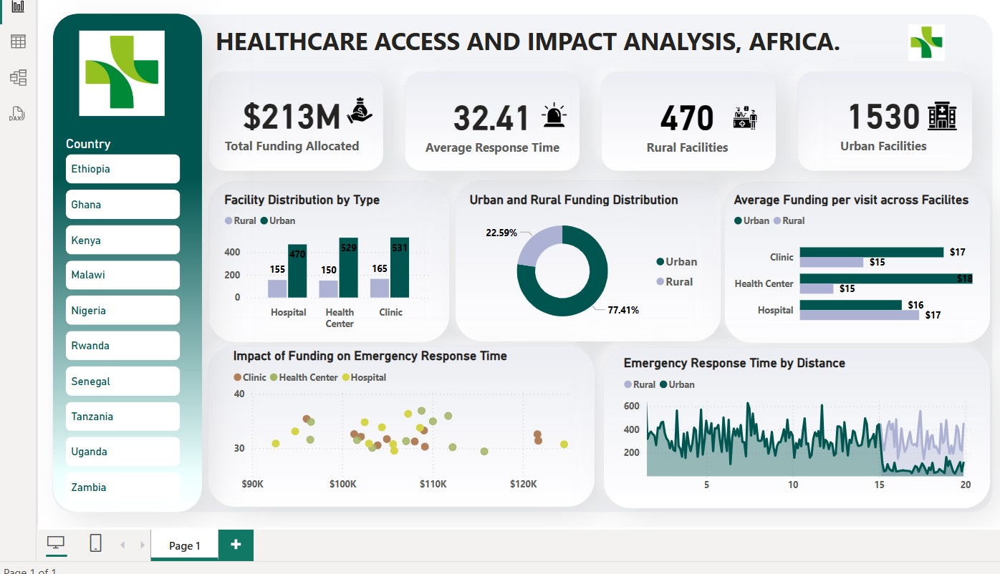

# Healthcare-Analytics
A Power BI project analyzing healthcare facility distribution, funding disparities, and emergency response times across African regions. Provides data-driven insights for policymakers and stakeholders.

## Tools Used
- **Power BI** for data visualization
- **Power Query** for cleaning and transformation
- **DAX** for creating KPIs and calculated columns

---

## Data Source
Dataset provided by **Axia Africa** for my capstone project. It includes:
- Healthcare facilities
- Funding data
- Emergency response metrics
- Patient visit records

---

## Process Overview

### 1. **Data Cleaning & Preparation**
- I Removed nulls and duplicates
- I Renamed and standardized columns
- I Created custom columns:
  - Urban/Rural classification
  - Funding categories (High, Medium, Low)
  - Funding per Visit

### 2. **Data Modeling**
- I Linked multiple tables via relationships:
  - Location ↔ Funding
  - Facility Type ↔ Visits
  - Country ↔ Response Time
- I Ensured data integrity for accurate analysis

### 3. **KPI Creation**
- **Total Healthcare Funding:** $213M
- **Average Emergency Response Time:** 32.41 minutes
- **Average Facility Visits:** 10.59K
- **Facility Count:** Urban – 1,530 | Rural – 470
- **Funding per Visit:** Custom DAX calculation

### 4. **Dashboard Design**
- KPI cards
- Clustered bar charts (Facility distribution)
- Pie charts (Funding allocation)
- Horizontal bar chart (Funding per visit)
- Line & scatter plots (Funding vs. Response)
- Country slicers for filtering

---

## Key Insights

- **Urban areas receive 3x more funding** than rural areas
- **No direct relationship** between high funding and faster response times
- **Rural regions have fewer facilities** and lower average visits
- **Funding per visit varies** by location and facility type

---

## Recommendations

- Allocate more funding to rural regions
- Invest in healthcare infrastructure outside urban zones
- Use telemedicine and AI to improve rural healthcare delivery
- Monitor efficiency using **Funding per Visit** KPI

---

## Dashboard Preview

